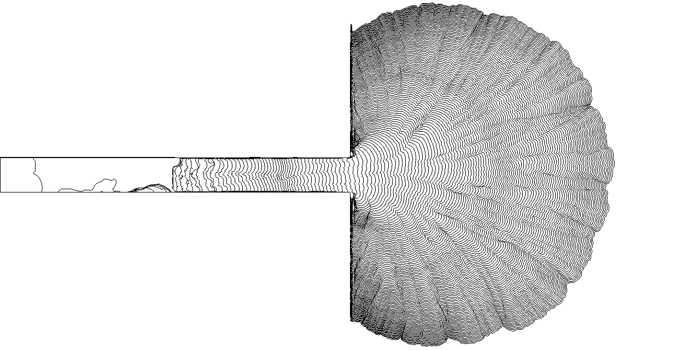

# 🌊 Waterflow Boundary Detection & Accumulation

This project utilizes Python and **OpenCV** to analyze fluid dynamics. The system performs boundary detection from raw video footage and accumulates these boundaries over time to create a comprehensive flow distribution map (accumulation map).

## 🎥 Visualizing the Results

Here is a comparison between the raw input data and the processed algorithmic output:

| Raw Video (Input) | Boundary Tracking (Output) |
|---|---|
|  |  |

## 🖼️ Boundary Accumulation Map

This is the final output generated by "stacking" every detected contour from the video frames onto a single plane. It visualizes the total area covered by the waterflow throughout the sequence.

  

## 🛠️ How it Works (Pipeline)

The algorithm processes each frame through the following steps:
1. **Preprocessing:** Converts the frame to Grayscale and applies `cv2.threshold` to create a binary mask.
2. **Contour Extraction:** Uses `cv2.findContours` with `RETR_EXTERNAL` mode to identify the outer boundary of the flow.
3. **Filtering:** Selects the largest contour by area to eliminate unwanted background noise.
4. **Accumulation:** Every 2 frames, the detected boundary is drawn onto a white canvas to build the static accumulation map.

